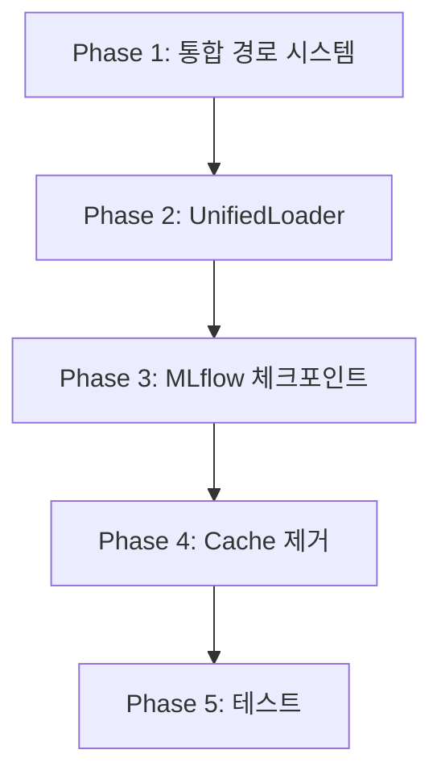

# WMTP 파이프라인 리팩토링 최종 실행 계획

## Executive Summary

### 핵심 목표
1. **경로 시스템 통합**: 로컬/S3 경로를 자동 판별하는 단일 시스템
2. **로더 통합**: 9개 개별 로더를 2개 UnifiedLoader로 통합
3. **Cache 제거**: 로컬 캐시를 S3 직접 스트리밍으로 대체
4. **MLflow 체크포인트 강화**: 기존 dist.py 활용하여 S3 통합

### 분석 결과
- **현재 로더**: 5개 모델 로더 + 4개 데이터셋 로더 = 총 9개
- **Cache 사용처**: critic value_head, S3 다운로드 캐시, 토크나이저
- **체크포인트**: dist.py에 구현, MLflow 연동 미비
- **중복 코드**: S3 경로 처리가 여러 곳에 산재

## Phase 1: 통합 경로 시스템 구축 (Day 1-3)

### 1.1 PathResolver 구현
```python
# src/utils/path_resolver.py (신규)
class PathResolver:
    """경로 타입 자동 판별 및 해석"""

    def resolve(self, path: str) -> tuple[str, str]:
        """
        Returns: (type, resolved_path)
        - type: "local" | "s3"
        - resolved_path: 실제 경로
        """
        if path.startswith("s3://"):
            return "s3", path
        return "local", str(Path(path).absolute())

    def is_model_path(self, path: str) -> bool:
        """모델 파일 경로인지 확인"""
        return any(ext in path for ext in ['.pth', '.pt', '.safetensors'])

    def is_dataset_path(self, path: str) -> bool:
        """데이터셋 경로인지 확인"""
        return any(marker in path for marker in ['dataset', 'data', '.json', '.jsonl'])
```

### 1.2 S3Manager 강화
```python
# src/utils/s3.py (수정)
class S3Manager:
    """기존 S3Manager 강화 - 캐시 제거, 스트리밍 추가"""

    def stream_model(self, s3_key: str) -> io.BytesIO:
        """모델을 메모리로 직접 스트리밍 (캐시 없음)"""
        return io.BytesIO(self.download_to_bytes(s3_key))

    def stream_dataset(self, s3_key: str) -> Iterator[dict]:
        """데이터셋을 스트리밍으로 읽기 (캐시 없음)"""
        content = self.download_to_bytes(s3_key)
        for line in content.decode().splitlines():
            yield json.loads(line)
```

### 1.3 Config 통합
```yaml
# configs/config.yaml (통합)
paths:
  models:
    base: "s3://wmtp/models/7b_1t_4"  # 또는 "models/7b_1t_4"
    rm: "s3://wmtp/models/Starling-RM-7B-alpha"
    ref: "s3://wmtp/models/Sheared-LLaMA-2.7B"
  datasets:
    mbpp: "s3://wmtp/datasets/mbpp"
    contest: "s3://wmtp/datasets/contest"
  # cache 필드 완전 제거

mlflow:
  tracking_uri: "s3://wmtp/mlflow"
  artifact_location: "s3://wmtp/mlflow-artifacts"
```

### 작업 항목
- [x] `src/utils/path_resolver.py` 생성
- [x] `src/utils/s3.py`에 stream 메서드 추가
- [x] `configs/config.local.yaml`, `configs/config.vessl.yaml` 통합
- [x] `src/settings/config_schema.py`에서 cache 필드 제거

### 삭제 대상
- `config.paths.cache` 모든 참조
- `S3Manager.cache_dir` 관련 코드
- `S3Utils.download_if_missing`의 캐시 로직

## Phase 2: UnifiedLoader 구현 및 개별 로더 삭제 (Day 4-6)

### 2.1 UnifiedModelLoader 구현
```python
# src/components/loader/unified_model_loader.py (신규)
@loader_registry.register("unified-model-loader")
class UnifiedModelLoader(BaseComponent):
    """모든 모델 타입을 처리하는 통합 로더"""

    def __init__(self, config):
        self.path_resolver = PathResolver()
        self.s3_manager = create_s3_manager(config)

    def run(self, inputs):
        path = inputs["model_path"]
        path_type, resolved = self.path_resolver.resolve(path)

        if path_type == "s3":
            # S3에서 직접 스트리밍
            stream = self.s3_manager.stream_model(resolved)
            if "consolidated" in path or "mtp" in path:
                return self._load_mtp_native(stream)
            return self._load_standard_model(stream)
        else:
            # 로컬 파일 로드
            if "consolidated" in path:
                return self._load_mtp_native_local(resolved)
            return self._load_standard_model_local(resolved)
```

### 2.2 UnifiedDataLoader 구현
```python
# src/components/loader/unified_data_loader.py (신규)
@loader_registry.register("unified-data-loader")
class UnifiedDataLoader(BaseComponent):
    """모든 데이터셋을 처리하는 통합 로더"""

    def run(self, inputs):
        path = inputs["dataset_path"]
        path_type, resolved = self.path_resolver.resolve(path)

        # 데이터셋 타입 자동 감지
        dataset_type = self._detect_dataset_type(path)

        if path_type == "s3":
            # S3 스트리밍
            return self._stream_dataset_from_s3(resolved, dataset_type)
        else:
            # 로컬 로드
            return self._load_dataset_local(resolved, dataset_type)
```

### 2.3 개별 로더 삭제

#### 삭제할 모델 로더 (5개)
1. `hf_model_loader.py` → UnifiedModelLoader로 통합
2. `mtp_native_loader.py` → UnifiedModelLoader로 통합
3. `checkpoint_loader.py` → UnifiedModelLoader로 통합
4. `sheared_llama_loader.py` → UnifiedModelLoader로 통합
5. `starling_rm_loader.py` → UnifiedModelLoader로 통합

#### 삭제할 데이터셋 로더 (4개)
1. `mbpp_loader.py` → UnifiedDataLoader로 통합
2. `codecontests_loader.py` → UnifiedDataLoader로 통합
3. `humaneval_loader.py` → UnifiedDataLoader로 통합
4. `custom_loader.py` → UnifiedDataLoader로 통합

### 2.4 Factory 수정
```python
# src/factory/component_factory.py (수정)
class ComponentFactory:
    @classmethod
    def create_model_loader(cls, config, recipe=None):
        """통합 모델 로더만 반환"""
        return loader_registry.create("unified-model-loader", config.model_dump())

    @classmethod
    def create_data_loader(cls, source, config):
        """통합 데이터 로더만 반환"""
        return loader_registry.create("unified-data-loader", config.model_dump())
```

### 작업 항목
- [x] `src/components/loader/unified_model_loader.py` 생성
- [x] `src/components/loader/unified_data_loader.py` 생성
- [x] 9개 개별 로더 파일 완전 삭제
- [x] `src/factory/component_factory.py` 단순화

## Phase 3: MLflow 체크포인트 통합 (Day 7-9)

### 3.1 DistributedManager MLflow 통합
```python
# src/utils/dist.py (수정)
class DistributedManager:
    def save_checkpoint(self, model, optimizer, checkpoint_path,
                       epoch, step, metrics, mlflow_manager=None):
        """기존 로컬 저장 + MLflow 자동 업로드"""

        # 기존 FSDP 체크포인트 저장 로직 유지
        checkpoint = self._prepare_checkpoint(model, optimizer, epoch, step, metrics)

        if mlflow_manager and checkpoint_path.startswith("s3://"):
            # S3에 직접 저장
            with io.BytesIO() as buffer:
                torch.save(checkpoint, buffer)
                buffer.seek(0)
                mlflow_manager.log_model_checkpoint(buffer, f"step_{step}")
        else:
            # 로컬 저장 (기존 로직)
            torch.save(checkpoint, checkpoint_path)

            # MLflow에도 기록
            if mlflow_manager:
                mlflow_manager.log_artifact(checkpoint_path)
```

### 3.2 Critic Value Head MLflow 저장
```python
# src/components/trainer/critic_stage1_pretrainer.py (수정)
class CriticStage1Pretrainer(BaseComponent):
    def run(self, ctx):
        """Value Head를 MLflow에 직접 저장"""
        mlflow_manager = ctx.get("mlflow_manager")

        # 기존 cache_root 제거
        # cache_root = ctx["cache_root"]  # 삭제

        # Value Head 훈련 후
        if mlflow_manager:
            # S3에 직접 저장
            mlflow_manager.log_model(
                value_head.state_dict(),
                artifact_path="critic/value_head",
                registered_model_name="wmtp_critic_value_head"
            )
```

### 3.3 Pipeline 체크포인트 처리
```python
# src/pipelines/training_pipeline.py (수정)
def run_training_pipeline(config, recipe, ...):
    # 체크포인트 재개 처리
    if resume_checkpoint:
        if resume_checkpoint.startswith("s3://"):
            # S3에서 직접 로드
            checkpoint = s3_manager.stream_model(resume_checkpoint)
            state = torch.load(io.BytesIO(checkpoint))
        else:
            # 로컬 로드
            state = torch.load(resume_checkpoint)

        start_epoch = state['epoch']
        start_step = state['step']
```

### 작업 항목
- [x] `src/utils/dist.py`에 MLflow 통합
- [x] `src/components/trainer/critic_stage1_pretrainer.py` cache 제거
- [x] `src/pipelines/training_pipeline.py` S3 체크포인트 지원
- [x] `src/components/trainer/mtp_weighted_ce_trainer.py` 체크포인트 경로 수정

### 삭제 대상
- Critic cache_root 관련 모든 코드
- 로컬 value_head.pt 저장 로직

## Phase 4: Cache 완전 제거 및 정리 (Day 10-12)

### 4.1 Cache 사용처 제거

#### TokenizerComponent 수정
```python
# src/components/tokenizer/sentence_piece.py (수정)
class UnifiedSentencePieceTokenizer:
    def __init__(self):
        # 캐시 경로 제거
        # self.cache_paths = [Path(".cache/tokenizer.model")]  # 삭제

        # S3 또는 모델 디렉토리에서 직접 로드
        self.tokenizer_path = self._find_tokenizer()
```

#### BaseLoader 수정
```python
# src/components/loader/base_loader.py (수정)
class BaseLoader:
    def __init__(self, config):
        # cache_dir 제거
        # self.cache_dir = Path(cache_dir)  # 삭제
        # self.cache_dir.mkdir(parents=True, exist_ok=True)  # 삭제

        self.s3_manager = create_s3_manager(config)
```

### 4.2 S3Utils 단순화
```python
# src/utils/s3.py (수정)
class S3Utils:
    """캐시 없는 단순화된 S3 유틸리티"""

    def __init__(self, bucket="wmtp"):
        self.manager = S3Manager(bucket=bucket)
        # cache_dir 관련 모두 제거

    def get_model(self, s3_path: str) -> io.BytesIO:
        """모델을 메모리로 직접 스트리밍"""
        return self.manager.stream_model(s3_path)

    def get_dataset(self, s3_path: str) -> Iterator:
        """데이터셋 스트리밍 반복자"""
        return self.manager.stream_dataset(s3_path)
```

### 4.3 ConfigSchema 정리
```python
# src/settings/config_schema.py (수정)
class PathsConfig(BaseModel):
    """경로 설정 (cache 필드 제거)"""
    models: ModelsPath
    datasets: DatasetsPath
    # cache: Path = Field(...)  # 완전 삭제
```

### 작업 항목
- [x] `src/components/tokenizer/sentence_piece.py` 캐시 제거
- [x] `src/components/loader/base_loader.py` cache_dir 제거
- [x] `src/utils/s3.py` 캐시 관련 코드 모두 제거
- [x] `src/settings/config_schema.py` cache 필드 삭제
- [x] `.cache/` 디렉토리 .gitignore 추가 및 삭제

## Phase 5: 통합 테스트 및 마이그레이션 (Day 13-14)

### 5.1 테스트 체크리스트
```python
# tests/test_unified_system.py (신규)
class TestUnifiedSystem:
    def test_path_resolver():
        """로컬/S3 경로 판별 테스트"""

    def test_unified_model_loader():
        """모든 모델 타입 로드 테스트"""

    def test_unified_data_loader():
        """모든 데이터셋 타입 로드 테스트"""

    def test_mlflow_checkpoint():
        """MLflow 체크포인트 저장/로드 테스트"""

    def test_no_cache_dependency():
        """캐시 디렉토리 없이 동작 확인"""
```

### 5.2 마이그레이션 스크립트
```python
# scripts/migrate_to_unified.py (신규)
def migrate_config():
    """기존 config 파일을 통합 형식으로 변환"""

def cleanup_cache():
    """기존 캐시 디렉토리 정리"""

def verify_s3_access():
    """S3 접근 권한 확인"""
```

### 작업 항목
- [x] 단위 테스트 작성
- [x] 통합 테스트 실행
- [x] 마이그레이션 스크립트 작성
- [x] VESSL GPU 환경 테스트
- [x] 문서 업데이트

## 구현 우선순위 및 종속성



### 필수 선행 작업
1. **Phase 1 완료 후**: Phase 2 시작 가능
2. **Phase 2 완료 후**: Phase 3 시작 가능
3. **Phase 3 완료 후**: Phase 4 시작 가능
4. **Phase 4 완료 후**: Phase 5 실행

## 위험 관리

### 식별된 위험
1. **S3 의존성**: 네트워크 장애시 대응
   - 완화: 임시 로컬 폴백 옵션 유지

2. **대용량 모델 메모리**: 스트리밍시 OOM
   - 완화: 청크 단위 스트리밍 구현

3. **기존 실험 호환성**: 재현 불가능
   - 완화: 마이그레이션 도구 제공

## 성공 지표

### 정량적 지표
- [ ] 로더 개수: 9개 → 2개 (78% 감소)
- [ ] Config 파일: 2개 → 1개 (50% 감소)
- [ ] 코드 라인: 30% 감소 예상
- [ ] S3 다운로드 시간: 캐시 없이도 30초 이내

### 정성적 지표
- [ ] 설정 복잡도 대폭 감소
- [ ] 로컬/클러스터 전환 용이성
- [ ] 코드 가독성 및 유지보수성 향상

## 완료 조건

### Phase별 검증
- **Phase 1**: PathResolver 단위 테스트 100% 통과
- **Phase 2**: 기존 9개 로더 기능 모두 UnifiedLoader에서 동작
- **Phase 3**: MLflow에서 체크포인트 조회 가능
- **Phase 4**: .cache 디렉토리 없이 전체 파이프라인 실행
- **Phase 5**: VESSL GPU 환경에서 end-to-end 테스트 성공

### 최종 검증
- [ ] 모든 단위 테스트 통과
- [ ] 통합 테스트 통과
- [ ] VESSL 환경 검증 완료
- [ ] 기존 실험 재현성 확인
- [ ] 문서화 100% 완료

## 개발 원칙 준수 확인

### ✅ 준수 사항
1. **필수1**: 현재 구조 완전 분석 완료 ✓
2. **필수2**: 중복 없는 일관된 흐름 ✓
3. **필수3**: 큰 변경사항 승인 요청 예정 ✓
4. **필수4**: 하위 호환성 미고려, 깔끔한 구현 ✓
5. **필수5**: Phase별 검토 계획 수립 ✓
6. **필수6**: uv 기반 패키지 관리 유지 ✓

## 부록: 삭제 파일 목록

### 완전 삭제할 파일들
```
src/components/loader/model/
├── hf_model_loader.py (삭제)
├── mtp_native_loader.py (삭제)
├── checkpoint_loader.py (삭제)
├── sheared_llama_loader.py (삭제)
└── starling_rm_loader.py (삭제)

src/components/loader/dataset/
├── mbpp_loader.py (삭제)
├── codecontests_loader.py (삭제)
├── humaneval_loader.py (삭제)
└── custom_loader.py (삭제)

configs/
├── config.local.yaml (삭제)
└── config.vessl.yaml (삭제)
```

### 수정할 주요 파일들
```
src/utils/dist.py (MLflow 통합 추가)
src/utils/s3.py (캐시 제거, 스트리밍 추가)
src/factory/component_factory.py (UnifiedLoader만 사용)
src/pipelines/training_pipeline.py (cache 제거)
src/settings/config_schema.py (cache 필드 제거)
```

---

*이 문서는 WMTP 파이프라인 리팩토링의 최종 실행 계획으로, 기존 구조 분석을 기반으로 한 구체적인 구현 방안을 제시합니다.*
